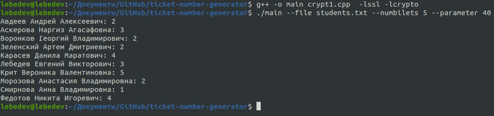

# Псевдослучайное распределение билетов

## Описание программы
Программа, генерирующая номера билетов для каждого человека, детерминированно связанные с ФИО и параметром распределения.

## Используемая хеш-функция
* SHA-256

## Конфигурация
Программа получает на вход `путь к файлу` со списком учеников, `кол-во используемых вариантов` для генерации билетов и `параметр`, меняющий распределение билетов, а также ключевые слова `--file`, `--numbilets` и `--parameter`.

## Сборка
Установите библиотеку OpenSSL:

```bash
sudo apt-get install libssl-dev
```

Соберите проект:

```bash
g++ -o main crypt1.cpp -lssl -lcrypto
```

## Запуск
Чтобы запустить проект в командной строке напишите (без "<, >"):

```bash
./main --file <путь к файлу> --numbilets <кол-во вариантов> --parameter <параметр распределения>
```

Пример запуска:

```bash
./main --file students.txt --numbilets 5 --parameter 40
```

## Пример сборки, запуска, работы программы



## Используемые несистемные библиотеки
openssl (https://www.openssl.org/)
